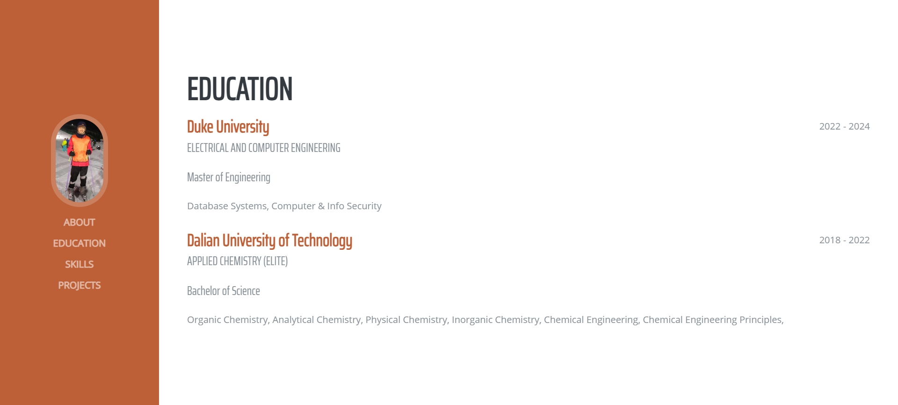
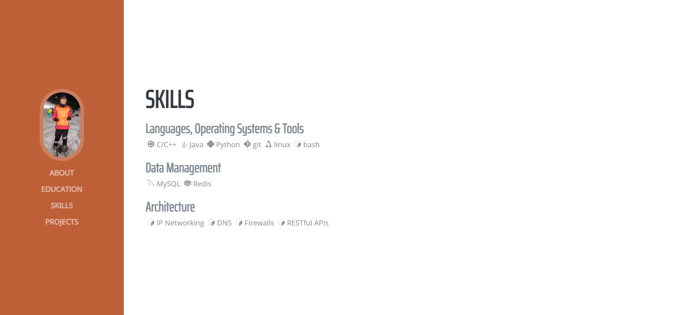

# Personal Website

This project is a personal website generated using [Zola](https://www.getzola.org/) with a template, which I have modified and deployed on AWS using Apache2 as the web server.

Website URL: [http://18.218.69.233/](http://18.218.69.233/)

## About (ABOUT)

This section contains my personal information.

## Education (EDUCATION)

Here, I showcase my academic background, including degrees earned and major courses undertaken.

## Skills (SKILLS)

This part outlines my skills and expertise in software development and other related fields.

## Projects (PROJECTS)

This section presents some of my project works from the IDS721 course, demonstrating my practical abilities in data science and software development.

## Deployment

The website is built using the Zola static site generator and deployed on AWS. Here are the brief steps for deployment:

1. **Install Zola**: Install the Zola static site generator locally.
2. **Generate Site**: Use Zola to generate static files.
3. **Upload to AWS**: Upload the generated static files to AWS.
4. **Configure Apache2**: Set up the Apache2 Web Server on AWS to serve the website.

## License

This project is licensed under the MIT License. For more details, please refer to the [LICENSE](LICENSE) file.
