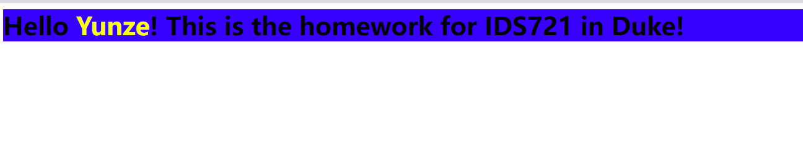

# AWS Lambda Function Deployment

This project demonstrates the creation, building, and deployment of an AWS Lambda function using Cargo Lambda on a university virtual machine. The Lambda function is accessible via a public URL and is deployed within the AWS infrastructure.

## Overview

The Lambda function created for this project is designed to run on AWS, showcasing the ability to execute serverless functions in response to HTTP requests. The development and deployment process leverages Cargo Lambda, a powerful tool for managing Rust-based Lambda functions.

## Prerequisites

- Access to a university-provided virtual machine with necessary permissions.
- AWS CLI installed and configured with appropriate AWS credentials.
- Rust and Cargo installed on the virtual machine.
- Cargo Lambda installed for managing Rust-based Lambda functions.

## Key Commands

The following key commands were used to create, build, and deploy the Lambda function:

1. **Create IAM Role**: First, we create an IAM role that the Lambda function will assume for execution permissions.

   ```
   aws iam create-role --role-name lambda_builder --assume-role-policy-document file://build_lambda_role.json
   ```

2. **Build Lambda Function**: Using Cargo Lambda, we build the function in release mode to optimize for production.

   ```
   cargo lambda build --release
   ```

3. **Deploy Lambda Function**: Finally, we deploy the Lambda function to AWS, enabling a function URL for public access.

   ```
   cargo lambda deploy --enable-function-url new-lambda-project
   ```

## Lambda Function URL

The deployed Lambda function is accessible at the following URL:

https://5qeb3rqx7b5mjtdgdrnk2hr2gm0aarpy.lambda-url.us-east-1.on.aws/


## Usage

To interact with the Lambda function and customize the greeting, append a query parameter `name` to the URL followed by your desired name. This will modify the response to include the specified name in the greeting. For example:

https://5qeb3rqx7b5mjtdgdrnk2hr2gm0aarpy.lambda-url.us-east-1.on.aws/?name=Yunze

Here's how it looks:



## Conclusion

This project illustrates the process of developing and deploying a serverless AWS Lambda function using Rust and Cargo Lambda. By leveraging the power of AWS and the efficiency of Rust, we can create scalable and cost-effective serverless applications.