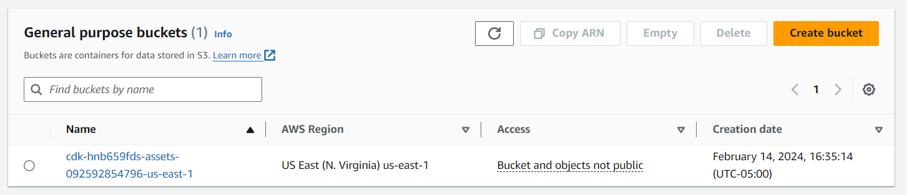
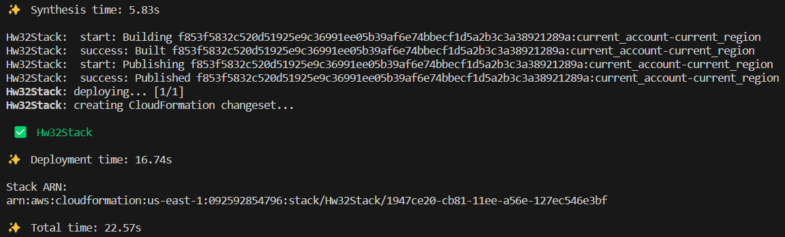

# Create an S3 Bucket using CDK with AWS CodeWhisperer

## Prerequisites

Before you begin, ensure you have the following installed and configured:

- **Node.js** 
- **AWS CDK**:   install -g aws-cdk`.
- **AWS CLI**
- **AWS Account**

## Setup

1. **Initialize a new CDK project**:
   - `cdk init app --language=typescript`

2. **Install dependencies**:
   - `npm install @aws-cdk/aws-s3` 

## Implementation

### Defining the S3 Bucket

Edit the `lib/hw3-2.ts` file to define the S3 bucket with versioning and encryption enabled. Below is a sample implementation:

```typescript
import * as cdk from 'aws-cdk-lib';
import { Construct } from 'constructs';
import * as sqs from 'aws-cdk-lib/aws-sqs';
import * as s3 from 'aws-cdk-lib/aws-s3';

export class Hw32Stack extends cdk.Stack {
  constructor(scope: Construct, id: string, props?: cdk.StackProps) {
    super(scope, id, props);

    const queue = new sqs.Queue(this, 'Hw32Queue', {
      visibilityTimeout: cdk.Duration.seconds(300)
    });
  }
}

export class MyS3Stack extends cdk.Stack {
  constructor(scope: Construct, id: string, props?: cdk.StackProps) {
    super(scope, id, props);

    const bucket = new s3.Bucket(this, 'MyEncryptedBucket', {
      versioned: true,
      encryption: s3.BucketEncryption.S3_MANAGED,
    });
  }
}

```

### Deploying the Stack

- `cdk deploy`

- `cdk bootstrap aws://092592854796/us-east-1`

- add privilege to the user

  

###Here are the result



## AWS CodeWhisperer Usage

While AWS CodeWhisperer did not directly generate the code snippets used in this project, it serves as a powerful tool for developers by providing code recommendations and best practices. AWS CodeWhisperer in VSCode will offer suggestions that can accept, helping to streamline the development process.


