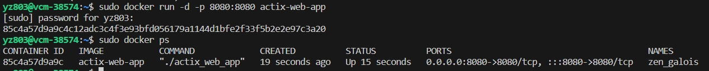
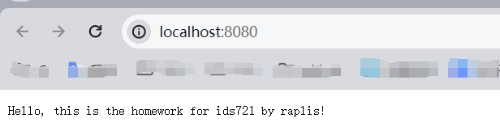

# Rust Actix Web Application Containerization

## Environment Requirements

- Rust Compiler: `rustc 1.75.0`
- Operating System: Ubuntu 22.04

## Steps to Containerize the Rust Actix Web App

### 1. Create the Rust Actix Web Application

* Adding dependency to the Cargo.toml  ```actix-web = "4.0.0"```

```rust
use actix_web::{web, App, HttpResponse, HttpServer, Responder};

async fn greet() -> impl Responder {
    HttpResponse::Ok().body("Hello, this is the homework for ids721 by raplis!")
}

#[actix_web::main]
async fn main() -> std::io::Result<()> {
    HttpServer::new(|| {
        App::new()
            .route("/", web::get().to(greet))
    })
    .bind("0.0.0.0:8080")?
    .run()
    .await
}

```


### 2. Build Docker Image

- Create a `Dockerfile` in the root directory of project.
- Use the Rust official image as the base image into the Docker image.
- Build the Docker image using the following command:

  ```shell
  docker build -t rust-actix-web-app .
  ```

### 3. Run Container Locally

- Once the Docker image is built, run the container locally using the command:

  ```shell
  docker run -d -p 8080:8080 rust-actix-web-app
  ```

- This command allows usto access the web application via `http://localhost:8080`.

### 4. Export Docker Image

- Export the Docker image :

  ```shell
  docker save -o rust-actix-web-app.tar rust-actix-web-app:latest
  ```

- This command saves the Docker image as a `.tar` file.

## Result






