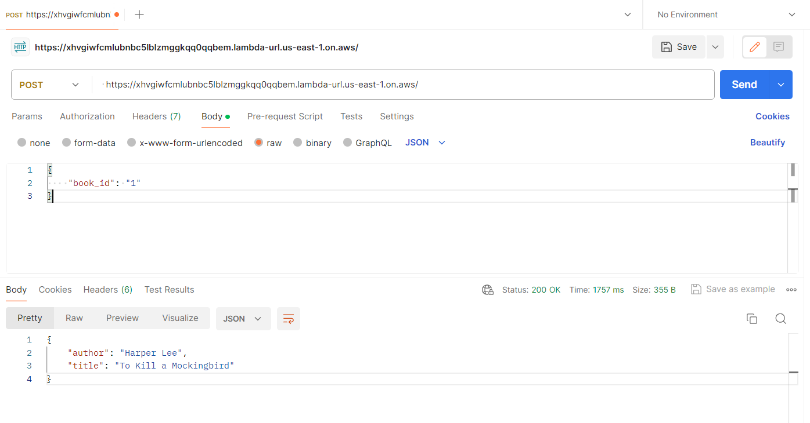

# Week 5 Mini-project

## Introduction

This project showcases the development of a Rust-based AWS Lambda function designed to interact with Amazon DynamoDB. The primary functionality of this service is to query book information by `book_id`, returning the book's title and author stored within the DynamoDB database. 

## Steps

1. **DynamoDB Table Setup**: Create a **DynamoDB** table named `Books` with `book_id` as the primary key. Populate the table with sample book data including `book_id`, `title`, and `author`. 

2. **Lambda Function Development**: Develop the Lambda function in Rust, ensuring it can query DynamoDB based on `book_id`.

   ```rust
   use lambda_runtime::{handler_fn, Context, Error};
   use serde::{Deserialize, Serialize};
   use rusoto_core::Region;
   use rusoto_dynamodb::{DynamoDb, DynamoDbClient, GetItemInput, AttributeValue};
   use std::collections::HashMap;
   use serde_json::{to_string, Value};
   
   #[derive(Deserialize)] 
   struct CustomEvent {
       book_id: String,
   }
   
   #[derive(Deserialize)]
   struct LambdaEvent {
       body: String,
   }
   
   #[derive(Serialize)]
   struct CustomOutput {
       title: String,
       author: String,
   }
   
   #[tokio::main]
   async fn main() -> Result<(), Error> {
       let func = handler_fn(func);
       lambda_runtime::run(func).await?;
       Ok(())
   }
   
   async fn func(event: Value, _: Context) -> Result<CustomOutput, Error> {
       // let event_json = to_string(&event).unwrap_or_else(|_| "Failed to serialize event".to_string());
       // println!("Received event: {}", event_json);
       let lambda_event: LambdaEvent = serde_json::from_value(event)?;
       let custom_event: CustomEvent = serde_json::from_str(&lambda_event.body)?;
       let client = DynamoDbClient::new(Region::UsEast1);
       let mut key = HashMap::new();
       key.insert(
           "bookId".to_string(),
           AttributeValue {
               s: Some(custom_event.book_id.clone()),
               ..Default::default()
           }
       );
   
       let get_item_input = GetItemInput {
           table_name: "Books".to_string(),
           key,
           ..Default::default()
       };
   
       let result = client.get_item(get_item_input).await?;
       println!("Got result: {:?}", result);
       let item = result.item.ok_or_else(|| "Book not found".to_string())?;
       if item is None() {
           return Ok(CustomOutput{title: "Title not found".to_string(), author: "Author not found".to_string()});
       }
       let title = item.get("title")
       .and_then(|attr| attr.s.as_ref())
       .ok_or_else(|| "Title not found".to_string())?
       .clone();
   
       let author = item.get("author")
       .and_then(|attr| attr.s.as_ref())
       .ok_or_else(|| "Author not found".to_string())?
       .clone();
   
       Ok(CustomOutput { title, author })
   }
   ```

   

3. **Deployment**:

   set enough privilege to the lambda function 

   ```bash
   cargo build --release --target x86_64-unknown-linux-musl
   cp target/x86_64-unknown-linux-musl/release/rust_lambda_service lambda_package/
   
   cd lambda_package/
   
   zip -r ../lambda_function.zip .
   
   cd ..
   aws lambda create-function --function-name rustLambdaFunction --zip-file fileb://lambda_function.zip --handler rust_lambda --runtime provided.al2 --role arn:aws:iam::092592854796:role/lambda_builder --timeout 15 --memory-size 128 --region us-east-1
   #this is used to update the function
   aws lambda update-function-code --function-name rustLambdaFunction --zip-file fileb://lambda_function.zip --region us-east-1
   ```

   

## Usage

You can use the postman to send a post to get the result.

and here's the url  https://xhvgiwfcmlubnbc5lblzmggkqq0qqbem.lambda-url.us-east-1.on.aws/

