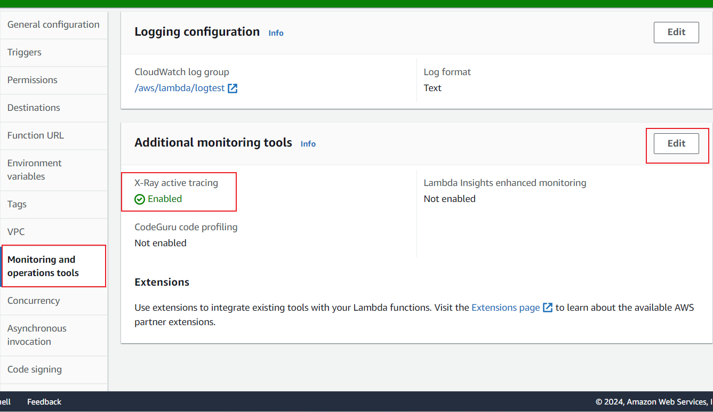
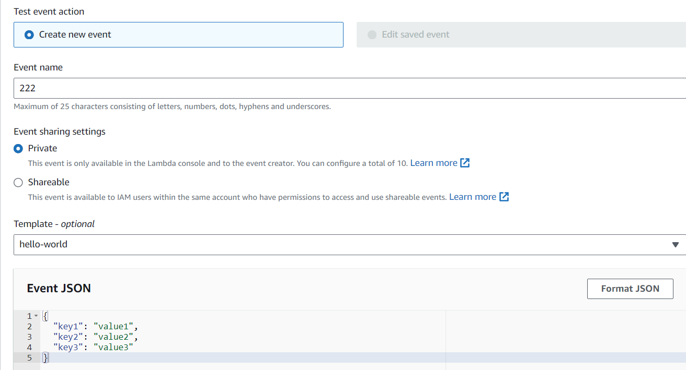
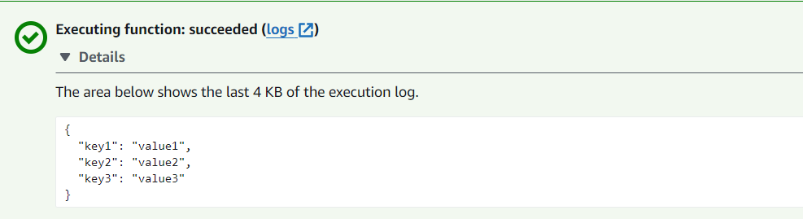
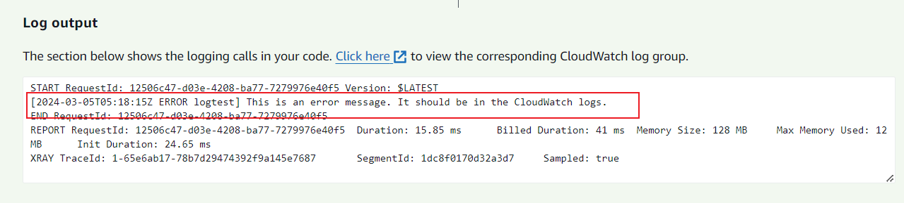
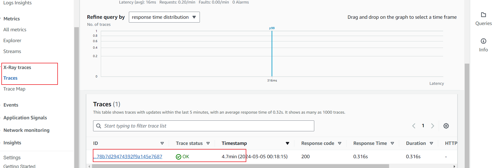

# Homework 6  Logging

This project use a Rust-based AWS Lambda function with logging capabilities, integrate AWS X-Ray tracing for detailed insight into the function's execution, and ensure all logs and traces are accessible through AWS CloudWatch for monitoring and analysis.

## Setup and Configuration

main.rs

```rust
use lambda_runtime::{handler_fn, Context, Error};
use log::{info, error};
use serde_json::Value;
use env_logger;

#[tokio::main]
async fn main() -> Result<(), Error> {
    env_logger::init();

    lambda_runtime::run(handler_fn(func)).await?;

    Ok(())
}

async fn func(event: Value, _: Context) -> Result<Value, Error> {
    info!("Dealing with the stuff: {:?}", event);
    error!("This is an error message. It should be in the CloudWatch logs.");
    Ok(event)
}

```


## Deployment

```bash

zip -r logtest.zip bootstrap

aws lambda create-function --function-name logtest --zip-file fileb://logtest.zip --handler rust_lambda --runtime provided.al2 --role arn:aws:iam::092592854796:role/lambda_builder --timeout 15 --memory-size 128 --region us-east-1


aws lambda update-function-code --function-name logtest --zip-file fileb://logtest.zip --region us-east-1
```

Above is the method to update or create the function using by AWS CLI


## Monitoring

Access logs and X-Ray traces through the AWS CloudWatch and AWS X-Ray consoles, respectively, to monitor and analyze the function's performance and troubleshoot issues.

Firstly we need to set up the X-ray monitoring for lambda function



And we use the test 222 to check the function




Here's the log output.



Here's the error message output.



It can be seen that there are logs in the  CloudWatch as well as X-Ray

