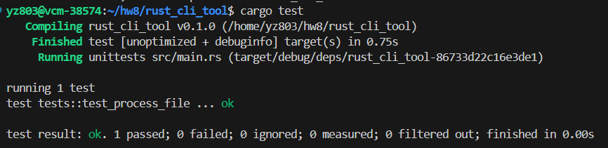
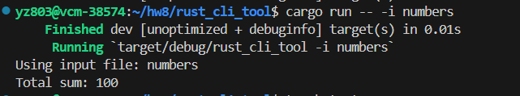

# Homework 8

## Description

This is a simple command-line tool written in Rust. It reads a text file, assuming each line contains a number, calculates the sum of these numbers, and prints the result to the console. This project aims to showcase basic Rust programming skills, including file I/O operations, command-line argument processing, and unit testing.

## Installation

Ensure you have Rust and Cargo installed. If not installed yet, you can find installation instructions on the [Rust official website](https://www.rust-lang.org/learn/get-started).

1. Clone the repository to your local machine:

   ```bash
   git clone https://gitlab.com/dukeaiml/cloud.git
   cd rust-cli-tool
   ```

2. Build the project:

   ```bash
   cargo build --release
   ```

## Usage

Navigate to the project's root directory in the command line, then use the following command to run the tool:

```bash
cargo run -- -i path/to/your/file.txt
```

Alternatively, use the compiled executable directly:

```bash
./target/release/rust_cli_tool -i path/to/your/file.txt
```

### Parameters

- `-i` / `--input` `<FILE>`: Specifies the path to the input file. If not specified, `default.txt` will be used by default.

## Features

- **Data Processing**: Reads the specified text file, treating each line as an integer for processing.
- **Sum Calculation**: Calculates the total sum of all the numbers read.
- **Command-Line Arguments**: Specifies the input file via command-line arguments.

## Unit Tests

This project includes unit tests to test the file processing functionality. Run tests with:

```bash
cargo test
```




## Sample Output

Assuming the input file `numbers` contains the following:

```
10
20
30
```

After running the tool, the output will be:



