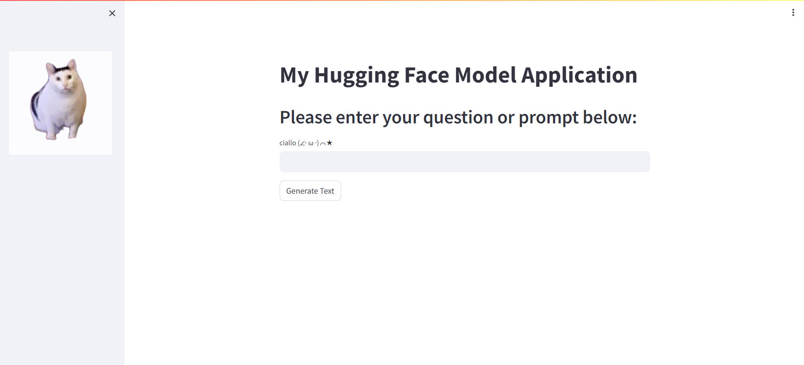
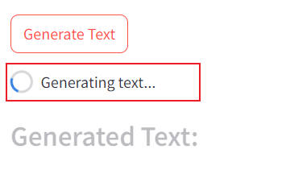
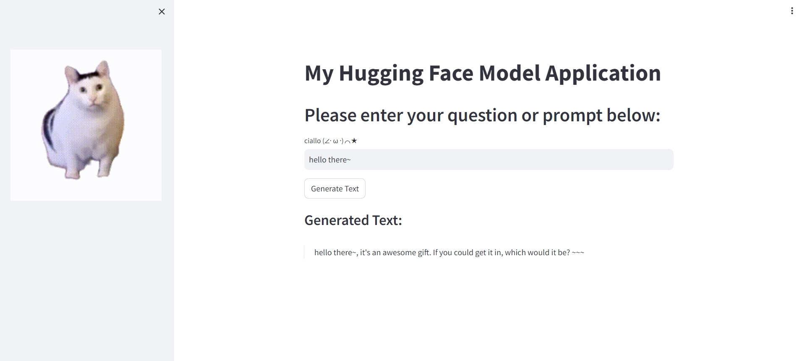

# Homework 9

### Streamlit App with Hugging Face's GPT-2 Model

This guide will walk you through creating a web application using Streamlit. We will connect to an open-source Large Language Model provided by Hugging Face(gpt2) , deploys it to a server, making it accessible via a browser.

#### Step 1: Install Dependencies
Install Streamlit and the Hugging Face Transformers library:

```bash
pip install streamlit transformers torch
```

#### Step 3: Create Your Streamlit App
Create a Python file for the website, e.g., `app.py`. Use the following template to start the Streamlit app that utilizes the GPT-2 model from Hugging Face:

```python
import streamlit as st
from transformers import pipeline
from PIL import Image
import requests
from io import BytesIO

image_url = "https://m.973.com/upload/images/20231016/20231016113714_66230.gif"
response = requests.get(image_url)
image = Image.open(BytesIO(response.content))
st.sidebar.image(image, use_column_width=True)

generator = pipeline('text-generation', model='gpt2')

st.markdown("# My Hugging Face Model Application")
st.markdown("## Please enter your question or prompt below:")

user_input = st.text_input("ciallo (∠· ω ·)⌒★")

if st.button('Generate Text'):
    with st.spinner('Generating text...'):
        outputs = generator(user_input, max_length=100, num_return_sequences=1, truncation=True)
    
    for output in outputs:
        st.markdown("### Generated Text:")
        st.markdown(f"> {output['generated_text']}")
```

This code snippet initializes the app, sets up a text input area, and generates a response from the GPT-2 model when the 'Generate' button is clicked.

#### Step 4: Run the Streamlit Website
Run the Streamlit app locally to test it:

```bash
export PATH="$HOME/.local/bin:$PATH"
source ~/.bashrc
streamlit run app.py
```

#### Step 5: Deploy the Website
```bash
streamlit run app.py
```

#### Accessing Website
This Streamlit app should now be accessible via a web browser through the URL `http://152.3.65.229:8501` 

#### Result

Here's the web page




I input hi there and it show us a rowing circle



Here is the result


