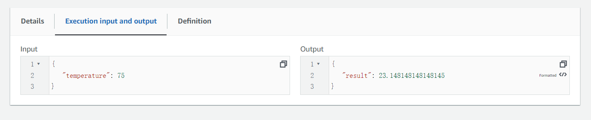
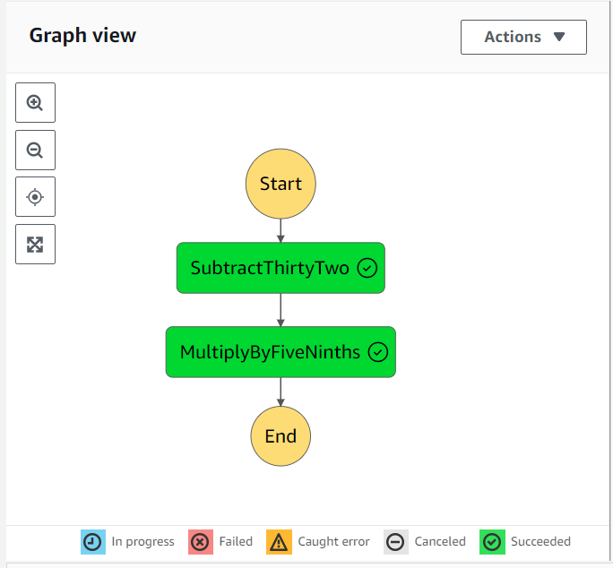

# Individual 4 - Fahrenheit to Celsius Data Processing Pipeline

This project demonstrates a serverless data processing pipeline that converts temperatures from Fahrenheit to Celsius. It leverages AWS Lambda functions for computation and AWS Step Functions for orchestrating the workflow.

And here's the link of [demo video](https://drive.google.com/file/d/1LD9ptIW0VXln6ZIy_eVAvGZ4Dyd4tsqw/view?usp=drive_link).

## Architecture
The pipeline is defined with two main steps, orchestrated by AWS Step Functions:

1. **SubtractThirtyTwo**: Subtracts 32 from the input Fahrenheit temperature.
2. **MultiplyByFiveNinths**: Converts the intermediate result to Celsius by multiplying by 5/9.

## Deployment

### Lambda Functions
Deploy two Lambda functions with the provided Rust code. The Rust application uses the `lambda_runtime` crate to handle Lambda events.

1. **Function for Subtracting 32**: Handles the subtraction of 32 from the Fahrenheit temperature.

   ```rust
   async fn subtract_thirty_two(event: Value, _: Context) -> Result<Value, Error> {
       println!("Received event: {:?}", event);
       match event.as_f64() {
           Some(fahrenheit) => Ok(json!({ "temperature": fahrenheit - 32.0 })),
           None => {
               if let Some(temp) = event.get("temperature").and_then(|v| v.as_f64()) {
                   Ok(json!({ "temperature": temp - 32.0 }))
               } else {
                   Err(Error::from("Expected a floating point input or an object with a 'temperature' floating point field"))
               }
           }
       }
   }
   ```

   

2. **Function for Multiplication**: Converts the intermediate value to Celsius by multiplying by 5/9.

   ```rust
   async fn subtract_thirty_two(event: Value, _: Context) -> Result<Value, Error> {
       println!("Received event: {:?}", event);
       match event.as_f64() {
           Some(fahrenheit) => Ok(json!({ "result": fahrenheit * 5.0 / 9.0 })),
           None => {
               if let Some(temp) = event.get("result").and_then(|v| v.as_f64()) {
                   Ok(json!({ "result": temp * 5.0 / 9.0 }))
               } else {
                   Err(Error::from("Expected a floating point input or an object with a 'result' floating point field"))
               }
           }
       }
   }
   ```

3. Cargo.toml

   ```
   [package]
   name = "rust_lambda_function"
   version = "0.1.0"
   edition = "2021"
   
   # See more keys and their definitions at https://doc.rust-lang.org/cargo/reference/manifest.html
   
   [dependencies]
   lambda_runtime = "0.4.1"
   tokio = { version = "1", features = ["full"] }
   serde = { version = "1.0", features = ["derive"] }
   serde_json = "1.0"
   ```

4. Pack the lambda up and upload it into aws.

   ```bash
   #!/bin/bash
   cp ./target/x86_64-unknown-linux-musl/release/rust_lambda_function ./target/x86_64-unknown-linux-musl/release/bootstrap
   zip -j my_lambda_function1.zip ./target/x86_64-unknown-linux-musl/release/bootstrap
   aws lambda update-function-code --function-name div31 --zip-file fileb://my_lambda_function1.zip --region us-east-1
   #cargo build --release --target x86_64-unknown-linux-musl
   #aws lambda create-function --function-name div31 --zip-file fileb://my_lambda_function1.zip --handler rust_lambda --runtime provided.al2 --role arn:aws:iam::092592854796:role/lambda_builder --timeout 15 --memory-size 128 --region us-east-1
   ```

   


### Step Functions Workflow

Define the Step Functions state machine using the provided JSON template. Replace the `Resource` ARNs withdeployed Lambda functions.

```json
{
  "Comment": "Fahrenheit to Celsius data processing pipeline",
  "StartAt": "SubtractThirtyTwo",
  "States": {
    "SubtractThirtyTwo": {
      "Type": "Task",
      "Resource": "arn:aws:lambda:us-east-1:092592854796:function:div3:$LATEST",
      "Next": "MultiplyByFiveNinths"
    },
    "MultiplyByFiveNinths": {
      "Type": "Task",
      "Resource": "arn:aws:lambda:us-east-1:092592854796:function:div31:$LATEST",
      "End": true
    }
  }
}
```

## Usage

Invoke the Step Functions state machine with a Fahrenheit temperature as input:



The state machine will execute the two steps in sequence and output the temperature in Celsius.



